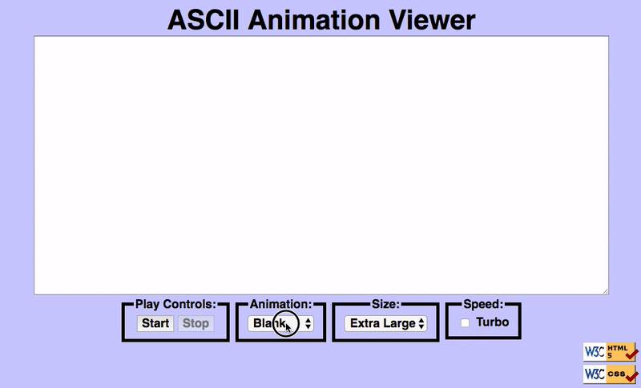

# ASCIImation Project

This assignment tests your understanding of JavaScript and its interaction with
the HTML user interface. You must match the appearance and behavior of the
following web page:



ASCII art renders pictures using ASCII/text characters. ASCII art has a long
history as a way to draw pictures on text-only monitors or printers. In this
project your will learn to draw animated ASCII art, or "ASCIImation." For
example, you can watch ASCIImated Star Wars on the commmand line with the
following commands:
0. Install `telnet`: `sudo apt-get install telnet`
1. Fetch the movie in ASCII characters: `telnet towel.blinkenlights.nl`
2. Close the terminal window to exit.

You are given a page `ascii.html` with a user interface(UI) for creating/viewing
ASCIImations. The page links to a style sheet `ascii.css` for styling the
page. You need to write your JavaScript code in `ascii.js` so that clicking
on the UI controls causes appropriate behavior. Your HTML page should link to
your JS file in a `<script>` tag.

You should also create an ASCIImation of your own. Your ASCIImation must show
non-trivial effort, must have multiple frames of animation, and must be entirely
your own work. Be creative! In total you will need to create the following files:
* __`ascii.js`__, the JavaScript code for your web page
* __`myanimation.js`__, with your custom ASCII animation added as JavaScript
  code (so it can be used on the page)

## Appearance Details
This part is done for you. The page could have been created by you using the
following specifications. The overall page has a background color of
```#CCCCFF```. The preferred font for all text on the page is the default
sans-serif font available on the system, in size ```14pt```, in bold. The top
of the page contains a heading in ```32pt``` bold text, centered horizontally
within the page. There is no margin between the heading content area and other
neighboring content on the page. Under the page's heading is a text box with
```80``` columns and ```20``` rows, centered horizontally. Its width is
```90%``` of the page size and height is ```400px```. It uses a ```12pt``` bold
monospace font, e.g. "Courier New", Courier, monospace for the font-family
property. CSS width/height properties will set the text box's size, but you must
put rows/cols attributes in your textarea HTML element for the page to validate.
Below the text box is a set of controls grouped into several field sets, each
with a ```5px``` black border around it and a label on top. Their behavior is
described below. The field sets appear in a row horizontally because their
display property makes them appear as ```inline``` elements. The tops of the
field sets are aligned through ```vertical-align``` property. The text area and
control field sets are centered horizontally.vBelow the controls is a
right-aligned section with images that are links to the W3C validators.

## Behavior Details
The following are the groups of controls at the bottom of the page and each
control's behavior, as demonstrated in the animated gif.
### Play controls
* __Start__: When clicked, animation begins. When the page is idle, all frames of
  the animation are visible. Frames are separated by 5 equals signs and a line
  break (\n) character. When animation starts, whatever text is currently in the
  text box is broken apart to produce frames of animation. This might be a
  pre-set animation, or text that the user has typed manually. During animation,
  one frame is visible at any moment, starting with the first frame. By default,
  the animation changes frames once every ```250``` ms. When the animation
  reaches the last frame, it loops back around and repeats indefinitely. You
  must implement your animation using a JavaScript timer with the
  ```setInterval``` function.
* __Stop__: When clicked, halts any animation in progress. When animation is
  stopped, the text that was in the box before animation began is __returned__ to
  the box.
* __Animation__: A drop-down list of ASCII animations. When one of the
  animations is chosen (a change event), the main text area updates to display
  all text of the chosen animation. The choices available are: Blank, Exercise,
  Juggler, Bike, Dive, Custom. Initially the Blank animation is selected and
  no text is showing in the text entry box.

  Your ```ascii.html``` page links to a provided file ```animations.js``` that
  declares the ASCIImations as global string variables named ```EXERCISE```,
  ```JUGGLER```, ```BIKE```, and ```DIVE```. You shouldn't edit this file, but
  your ```ascii.js``` file can refer to these variables. For example, if you have
  a textarea on your page with an id ```mytextarea```:
  ```
  $("#myextarea").val(JUGGLER);
  ```

  The provided animations.js file also defines a global associative array named
  ```ANIMATIONS``` that maps from indexes (keys) that are strings equal to the
  names of the animations, such as "Bike" or "Exercise", to values that are long
  strings representing the entire animation text for that image. Using this array
  well can help you avoid redundancy. Here is an example on how to use the
  ```ANIMATIONS``` array:
  ```
  var whichOne = "Juggler";
  $("#mytextarea").val(ANIMATIONS[whichOne]);
  ```

  The user may type new text in the field after choosing a pre-set animation. The
  animation shown when Play is pressed should reflect these changes. (i.e., Don't
  capture the text to animate until the user presses the Start button.)
  You may assume that the user will not try to type into the text area while
  animation is in progress. You may also assume that the user will not use the
  selection box to change to a new animation while animation is occurring;
  assume that the user will stop any existing animation before changing to a new
  one.

  The Custom choice in the Animation box should show an animation that you have
  created. You can convert your animation to a string you can put into
  ```myanimation.js``` using the
  [String Maker tool](http://www.cs.washington.edu/education/courses/cse190m/12sp/homework/6/stringmaker.html).

* __Size__: A drop-down list of font sizes. When one of the font sizes is chosen, it
  immediately sets the font size in the main text area. The font sizes listed in
  the drop-down list, and the corresponding font size to set, are:
  * ```Tiny (7pt)```
  * ```Small (10pt)```
  * ```Medium (12pt)```
  * ```Large (16pt)```
  * ```Extra Large (24pt)```
  * ```XXL (32pt)```

  Initially Medium is selected and the text is```12pt``` in size. If the
  animation is playing and one of these buttons is clicked, the font size
  changes immediately. Note that when you write the code for changing the font
  sizes, it is easy to introduce redundancy. By setting a value attribute on
  each of the options in the drop-down list, you can avoid a long series of
  ```if/else``` statements.
* __Speed__: Contains a single checkbox labeled "Turbo". When the box (or the
  text next to it) is clicked, causing the box to become checked, it sets the
  speed of animation to use a ```50ms``` delay instead of ```250ms```. When
  unchecked, the speed goes back to ```250ms```. Initially the box is unchecked
  and the delay is ```250ms```. If the animation is playing and the box is
  checked/unchecked, the change should take effect __immediately__ (the user
  shouldn't have to stop and restart the animation to see the change). Checking
  the box shouldn't cause the animation to start if it wasn't already started.
  It also shouldn't reset what frame is showing; it should just change the
  delay.

### Control enabling/disabling
Modify your UI to disable elements that the user shouldn't be able to click at
a given time. Initially and whenever animation is not in progress, the Stop
button should be disabled. When animation is in progress, Start and the select
box of animations should be disabled. The Size box and Turbo checkbox should
always be enabled.

You can enable or disable a control throug its ```disabled``` property. For
example, to disable a control with id of ```customerlist```:
```
$("#customerlist").attr("disabled", "disabled");
```

## Development Strategy and Hints:
Write a small amount of "starter" JS code and make sure that it runs.
(For example, make it so that when the Start button is clicked, an alert box
appears.)
Implement code to change the animation text and font sizes. Make it so that
when an option is chosen in the selection box, the proper text string appears
in the text area. Get the font size options working.
Implement a minimal Start behavior so that when Start is clicked, a single
frame of animation is shown. Clicking Start multiple times would show
successive frames of animation.
Use a JavaScript timer to implement the proper animation based on your previous
code.
Use the developer tools in Chrome to help debug your code. Such tools will show
syntax errors in your JavaScript code on the console. You can set breakpoints,
type expressions on the console, and watch variables' values.
