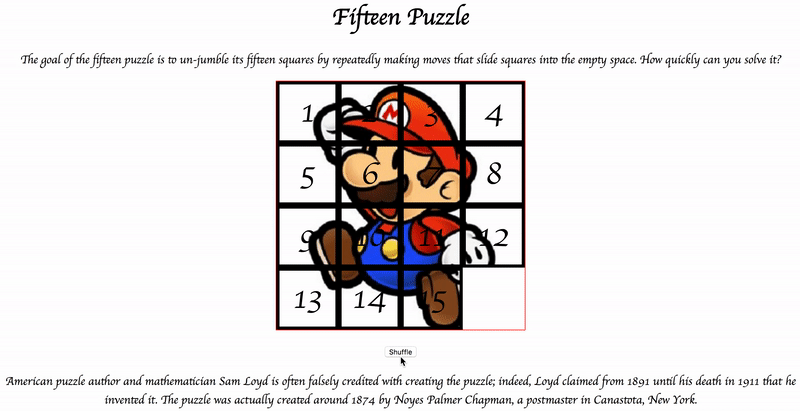

# Fifteen Puzzle
This assignment is about JavaScript's Document Object Model (DOM) and
events. You'll create the following app:

## Background Information
The Fifteen Puzzle (also called the Sliding Puzzle) is a simple classic game
consisting of a 4x4 grid of numbered pieces with one missing. The object
of the game is to arrange the pieces into numerical order by repeatedly sliding
a piece that neighbors the missing piece into the empty space.

You will write JavaScript code for a page `fifteen.html` that plays the Fifteen
Puzzle. You can also choose a background image of your own choosing,
displayed underneath the pieces of the board. Choose any image you like, so long
as its pieces can be distinguished on the board.The files you need to
create/use are as follows:
* *fifteen.js*, the JavaScript code for your web app
* *fifteen.css*, the CSS styles for your web page
* background.jpg, your background image (optional), suitable for a puzzle of
  size 400x400px

You will not directly write any HTML code.The provided HTML should not be
modified. You will write JavaScript code that interacts with the DOM using the
jQuery API. To modify the page's appearance, write appropriate javascript code
to change styles of on-screen elements by setting classes, IDs, and/or style
properties on them.

## Appearance Details
All text on the page is displayed in a "cursive" font family, at a default font
size of 14pt. Everything on the page is centered, including the top heading,
paragraphs, the puzzle, the Shuffle button, and the W3C buttons at bottom.

In the center of the page are fifteen pieces representing the puzzle.The overall
puzzle occupies 400x400 pixels on the page, horizontally centered. Each puzzle
piece occupies a total of 100x100 pixels, but `5px` on all four sides are
occupied by a black border.This leaves 90x90 pixels of area inside each piece.

Each piece displays a number from 1 to 15, in a `40pt` font.When the page
loads, initially the pieces are arranged in their correct order with the missing
piece in the bottom-right. Each piece displays part of the image
`background.jpg`, which you should put in the same folder as your page.
Which part of the image is displayed by each piece is related to that piece's
number. The "1" piece shows the top-left 100x100 portion of the image.  The "2"
piece shows the next 100x100px of the background that would be to the right of
the part shown under the "1" piece, and so on. (Your background image appears
on the puzzle pieces when you set it as the background-image of each piece. By
adjusting the "background-position" of each div, you can show a different part
of the background on each piece. One confusing thing about background-position
is that the x/y values shift the background behind the element, not the element
itself. The offsets are the negation of what you may expect.For example, if you
wanted a 100x100px div to show the top-right corner of a 400x400px image, set
its `background-position` property to `-300px 0px`.)

Centered under the puzzle pieces is a Shuffle button that can be clicked to
randomly rearrange the pieces of the puzzle.

## Behavior Details
When the mouse button is pressed on a puzzle piece, if that piece is next to
the empty space, it is moved into the empty space.If the piece does not neighbor
the empty space, no action occurs. Similarly, if the mouse is pressed on the
empty piece or elsewhere on the page, no action occurs.

When the mouse hovers over a piece that can be moved (neighbors the empty space),
its border and text color should become red. Once the cursor is no longer
hovering on the piece, its appearance should revert to its original state.
Hovering over a piece that cannot be moved should have no effect.
(you can use the `:hover` CSS pseudo-class.)

When the Shuffle button is clicked, the pieces of the puzzle are randomized.
The pieces must be rearranged into a solvable state. Note that some puzzle
states are not solvable; for example, it has been proven that the puzzle cannot
be solved if you switch only its 14 and 15 pieces. We suggest that you generate
a random valid solvable puzzle state by repeatedly choosing a random neighbor
of the missing piece and sliding it onto the empty space. A few hundred such
random movements should produce a shuffled board. Your algorithm should be
relatively efficient; it shouldn't take more than a second to run.

The game is not required to take any particular action when the puzzle has been
won. You can decide if you'd like to popup an alert box congratulating the user
or add any other optional behavior to handle this event.

## Development Strategy
* Use CSS to style the page except for the piece locations, which will be set
  in JavaScript. It might be helpful to give a thin border initially to the
  "puzzlearea" div so you can see its boundary when positioning the pieces.
* Use JavaScript to make the fifteen puzzle pieces appear in the correct
  positions without any background behind them.
* Make the correct parts of the background show through behind each piece.
* Write the code that moves a piece when it is clicked from its current
  location to the empty space's location. Don't worry initially about whether
  the clicked piece is next to the empty space.
* Write code to determine whether a piece can move or not (whether it neighbors
  the empty space).
* Implement the highlight when the user's mouse hovers over pieces that can be
  moved. You must keep track of where the empty space is at all times.
* Write the shuffling algorithm. We suggest first implementing the code to
  perform a single random move; that is, randomly picking one piece that
  neighbors the empty space and moving that piece to the empty space. Get it to
  do this one time when Shuffle is clicked, then work on doing it many times
  in a loop.

## Hints
Use absolute positioning to set the x/y locations of each puzzle piece. The
overall puzzle area must use a relative position in order for the x/y offsets
of each piece to be relative to the puzzle area's location.

Convert a string to a number using `parseInt`. This also works for strings
that start with a number and end with non-numeric content.For example,
`parseInt("123four")` returns `123`.

You will need to incorporate randomness in your shuffle algorithm. You can
generate a random integer from 0 to N, or randomly choose between N choices,
by using `parseInt(Math.random() * N)`
.
We suggest that you do not explicitly make a div to represent the empty piece.
Keep track of where it is, either by row/column or by x/y position, but don't
create an actual element for it. We also suggest that you not store your
puzzle pieces in a 2-D array. This might seem like a good structure because of
the 4x4 appearance of the grid, but it will be difficult to keep such an array
up to date as the pieces move.

You should consider writing functions for common operations, such as moving a
particular piece, or for determining whether a given piece currently can be
moved. The `this` reference can be helpful for reducing redundancy.

At some point you will find yourself needing to get access to the DOM object
for the piece at a particular row/column or x/y position. We suggest you write
a function that accepts a row/column as parameters and returns the DOM object
for the corresponding piece. It may be helpful to you to give an id to each
piece, such as "piece_2_3" for the piece in row 2, column 3, so that you can
more easily access the pieces later in your JavaScript code.
(If any piece moves, you will need to update its id value to match its new location.) Don't break apart the string "piece_2_3" to extract the 2 or 3 from it.  Instead, use the ids in the opposite direction: To access the DOM object for the piece at row 2, column 3, make an id string of "piece_2_3".

